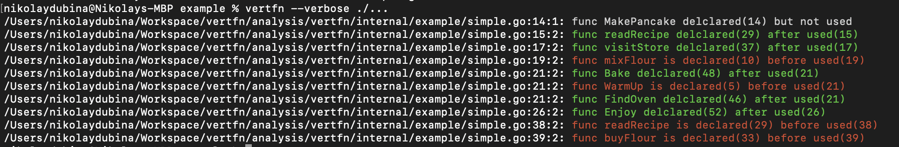

## 🎋 vertfn — Go linter for Vertical Function Ordering

[](https://goreportcard.com/report/github.com/nikolaydubina/vertfn)
[](https://github.com/nikolaydubina/go-recipes)

> _Disclaimer: false positives; practically this is useful for "exploration" rather than for "enforcement"_

> **Vertical Ordering**   
> In general we want function call dependencies to point in the downward direction. That is, a function that is called should be bellow a function that does the calling. This creates a nice flow down the source code module from the high level to low level.
> As in newspaper articles, we expect the most important concepts to come first, and we expect them to be expressed with the least amount of polluting detail. We expect the low-level details to come last. This allows us to skim source files, getting the gist from the frist few functions, without having to immerge ourselves in the details.  
> — Clean Code, Chapter 5, p84, Robert C. Martin, 2009


```go
go install github.com/nikolaydubina/vertfn@latest
```

```bash
verfn --verbose ./...
```



## False Positives

Improving false positive rate is good, such as for following cases:

 * same function names but different classes
 * same function names but from different packages
 * functions passed as arguments
 * functions passed as arguments and argument name matches existing function names 

## Appendix A: Canonical Java Example

Clean Code, Chapter 5, code example `WikiPageResponder.java`

<details>
<summary>
code
</summary>

```java
public class WikiPageResponder implements SecureResponder {
  protected WikiPage page;
  protected PageData pageData;
  protected String pageTitle;
  protected Request request;
  protected PageCrawler crawler;

  public Response makeResponse(FitNesseContext context, Request request)
    throws Exception {
    String pageName = getPageNameOrDefault(request, "FrontPage");
    loadPage(pageName, context);
    if (page == null)
      return notFoundResponse(context, request);
    else
      return makePageResponse(context);
  }

  private String getPageNameOrDefault(Request request, String defaultPageName)
  {
    String pageName = request.getResource();
    if (StringUtil.isBlank(pageName))
      pageName = defaultPageName;

    return pageName;
  }

  protected void loadPage(String resource, FitNesseContext context)
    throws Exception {
    WikiPagePath path = PathParser.parse(resource);
    crawler = context.root.getPageCrawler();
    crawler.setDeadEndStrategy(new VirtualEnabledPageCrawler());
    page = crawler.getPage(context.root, path);
    if (page != null)
      pageData = page.getData();
  }

  private Response notFoundResponse(FitNesseContext context, Request request)
    throws Exception {
    return new NotFoundResponder().makeResponse(context, request);
  }

  private SimpleResponse makePageResponse(FitNesseContext context)
    throws Exception {
    pageTitle = PathParser.render(crawler.getFullPath(page));
    String html = makeHtml(context);

    SimpleResponse response = new SimpleResponse();
    response.setMaxAge(0);
    response.setContent(html);
    return response;
  }
  
  ...
}
```
</details>
